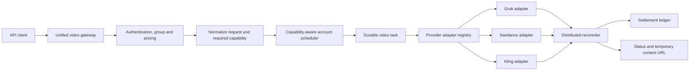

# Unified Video Generation Gateway Design

**Date:** 2026-08-04

**Status:** Approved

**Scope:** First release

**Supersedes:** `docs/superpowers/plans/2026-07-09-video-generation-gateway.md`

## 1. Summary

Sub2API will expose one provider-neutral asynchronous video API covering the same five operations already exposed for Grok:

- create a video generation task;
- create a video edit task;
- create a video extension task;
- query a task;
- download task content.

The first release adds a generic `video` platform. Accounts on this platform select an upstream provider, initially `seedance` or `kling`. Existing Grok accounts remain on the `grok` platform and keep their current text, image, OAuth, and video behavior.

A durable PostgreSQL task record becomes the source of truth for every new video task. A distributed reconciler queries upstream tasks, completes billing, and recovers after process or Redis restarts. The caller receives the upstream temporary result URL and is responsible for downloading or persisting the video before it expires. Sub2API does not add object storage in this release.

## 2. Context

The repository already contains a Grok-specific media gateway with these routes:

- `POST /v1/videos/generations`
- `POST /v1/videos/edits`
- `POST /v1/videos/extensions`
- `GET /v1/videos/{request_id}`
- `GET /v1/videos/{request_id}/content`

The existing Grok implementation handles account selection, media capability checks, model mapping, failover, upstream forwarding, usage logging, and content proxying. Video request ownership is currently bound to an upstream account through Redis rather than a durable video task table.

The existing group model permits only one concrete platform per group. The repository also has composite groups that can combine concrete platform groups. Existing Grok video pricing is represented by resolution-oriented group fields and is not flexible enough for provider, model, operation, duration, and audio combinations.

The older July video gateway plan predates the current Grok implementation and current migrations. Its useful concepts are incorporated here, but its schema numbers, Seedance-only scope, and implementation sequence must not be followed verbatim.

## 3. Product goals

### 3.1 Goals

1. Give API customers one stable video API rather than separate Seedance and Kling APIs.
2. Preserve compatibility with the existing Grok video routes and accepted request aliases.
3. Support provider-explicit external model names such as `seedance-2.0` and `kling-3.0`.
4. Support text generation, first-frame generation, first-and-last-frame generation, references, editing, and extension when the selected upstream model provides the required capability.
5. Let multiple provider accounts or endpoints serve the same external model for load balancing and failover.
6. Guarantee durable task recovery and exactly-once financial settlement in a multi-instance deployment.
7. Freeze estimated user funds at submission, settle successful work, and refund failures.
8. Keep provider-specific differences inside adapters and a small, validated `provider_options` escape hatch.
9. Reuse the existing Sub2API administration patterns for accounts, groups, pricing, usage, and error details.

### 3.2 Non-goals

The first release will not:

- permanently store generated videos;
- provide a customer-facing video creation workspace;
- silently replace an explicitly requested provider model with another provider;
- emulate unsupported upstream capabilities;
- expose arbitrary upstream request payload passthrough;
- add task cancellation, because the current Grok-compatible surface does not include it;
- automatically run billable provider tests when an administrator saves an account;
- replace or migrate Grok text/image behavior to the generic `video` platform.

## 4. Key decisions

| Area | Decision |
|---|---|
| Platform | Add one generic `video` platform |
| Providers | Account-level `provider`: `seedance` or `kling` |
| Grok | Remains a separate `grok` platform |
| External models | Provider-explicit names; no generic cross-provider aliases |
| API surface | Preserve the five current Grok video routes |
| Persistence | PostgreSQL task table is authoritative |
| Redis | Locks, scheduling acceleration, and temporary caches only |
| Output | Return upstream temporary URL plus `expires_at` |
| Billing | Freeze on submit, settle on success, refund failure |
| Reconciliation | Background workers run independently of customer polling |
| Unsupported operations | Fail before charging with `unsupported_capability` |
| Multi-instance safety | Database leases and `FOR UPDATE SKIP LOCKED` |

## 5. Architecture



The gateway owns authentication, permission checks, request normalization, moderation, pricing, idempotency, task creation, and public response formatting. It does not contain provider payload branches.

The adapter registry resolves the implementation by account platform and account provider:

- `grok` account -> Grok video adapter;
- `video` + `seedance` -> Seedance adapter;
- `video` + `kling` -> Kling adapter.

The common task service owns lifecycle transitions and settlement. Provider adapters only translate requests, submit tasks, query tasks, and resolve content.

## 6. Platform, accounts, and groups

### 6.1 Generic video platform

Add `video` to backend and frontend platform validators and platform-aware administration surfaces.

A `video` account contains:

- provider (`seedance` or `kling`);
- encrypted API credentials;
- base URL and provider-required workspace/project identifiers;
- external-to-upstream model mappings;
- concurrency and scheduling settings;
- optional proxy;
- disabled capability overrides;
- group bindings.

Provider-specific credentials remain structured and validated. They must not be stored in an unvalidated arbitrary JSON field or written to logs.

### 6.2 Model routing

External names remain provider-explicit. An account participates only when it maps the exact requested external model and satisfies the required operation and media capabilities.

For example, a request for `seedance-2.0` can fail over among multiple Seedance keys or endpoints mapping `seedance-2.0`; it cannot switch to `kling-3.0`.

### 6.3 Combining Grok with other providers

Existing Grok groups continue working directly. A normal `video` group can contain Seedance and Kling accounts because both share the `video` platform. If an administrator wants one API key/group to include Grok and generic video accounts, the existing composite-group mechanism should combine a Grok group and a video group.

## 7. Public API contract

### 7.1 Routes

The first release preserves these routes:

| Method and path | Operation |
|---|---|
| `POST /v1/videos/generations` | Generate from text, frames, or references |
| `POST /v1/videos/edits` | Edit an existing video |
| `POST /v1/videos/extensions` | Extend an existing video |
| `GET /v1/videos/{request_id}` | Query normalized task status |
| `GET /v1/videos/{request_id}/content` | Proxy downloadable content |

### 7.2 Common request fields

The normalized generation request supports:

- `model` (required);
- `prompt`;
- `duration`;
- `resolution`;
- `aspect_ratio`;
- `first_frame`;
- `last_frame`;
- `reference_images`;
- `reference_videos`;
- `audio`;
- `provider_options`.

The edit and extension requests additionally accept a source `video` URL. Provider-specific options are namespaced by provider and validated against an explicit whitelist. Unknown options are rejected rather than forwarded blindly.

Existing Grok aliases remain accepted, including `image`, `images`, and the currently supported reference-image forms. The normalizer maps aliases to a canonical internal request without changing existing Grok clients.

### 7.3 Idempotency

Submission routes accept `Idempotency-Key`. The uniqueness scope is the authenticated user, API key, route/operation, and idempotency key. Repeating the same submission returns the original task. Reusing the same key with a materially different normalized payload returns `idempotency_conflict`.

### 7.4 Submission response

The common response contains at least:

```json
{
  "request_id": "vid_...",
  "status": "queued",
  "created_at": 1785800000
}
```

The gateway preserves fields necessary for existing Grok compatibility while ensuring `request_id` remains the public stable identifier.

### 7.5 Query response

Public statuses are:

- `queued`;
- `running`;
- `succeeded`;
- `failed`;
- `cancelled` (recognized for upstream compatibility even though first-release cancellation is not exposed).

A successful response includes `video_url`, `expires_at`, content type, duration, resolution, and any safe normalized metadata available from the provider. The public response must not disclose upstream credentials, internal account IDs, raw provider payloads, or private error details.

`video_url` is the upstream temporary download URL when it is safe and directly usable by the caller. If an upstream result requires provider authentication or must not be exposed, `video_url` points to the authenticated Sub2API content route instead. In both cases, `expires_at` reflects the effective download deadline.

### 7.6 Content endpoint

The content endpoint proxies only the result URL recorded by a trusted adapter for the authenticated task owner. It retains HTTP Range support and bounded timeouts. It is not a general URL proxy.

### 7.7 Standard errors

Stable public error codes include:

- `unsupported_capability`;
- `invalid_media`;
- `pricing_not_configured`;
- `no_eligible_account`;
- `upstream_rate_limit`;
- `upstream_task_failed`;
- `idempotency_conflict`;
- `video_request_not_found`.

Sanitized provider detail may be included where safe. Full upstream responses remain in protected operational records.

## 8. Capability model

Capabilities are declared per provider and upstream model. The initial vocabulary is:

- text-to-video;
- first-frame image-to-video;
- first-and-last-frame image-to-video;
- reference images;
- reference video;
- video edit;
- video extension;
- generated audio;
- supported duration range;
- supported resolutions;
- supported aspect ratios.

The built-in provider model catalog is authoritative about capabilities known to the adapter. Account configuration may disable capabilities but cannot force-enable a capability the adapter marks unsupported.

The required capability is derived before scheduling and before funds are frozen. If no account can satisfy the request, the gateway returns `unsupported_capability` or `no_eligible_account` without charging the user.

Provider capability sources must be verified during implementation. Public Alibaba Cloud documentation confirms that its hosted Kling models support text-to-video, first-frame, first-and-last-frame, references, and video editing. This is useful capability evidence but does not replace verification of the direct Kling Open Platform authentication and request contract selected for this project. Fire-and-forget assumptions about native Kling fields are prohibited.

## 9. Durable task model

Add a PostgreSQL `video_tasks` entity/table. Exact naming may follow repository conventions, but it must contain the following logical fields:

### 9.1 Identity and ownership

- internal primary key;
- public request ID;
- user ID;
- API key ID;
- group ID;
- subscription or billing subject reference where applicable;
- account ID;
- provider;
- operation.

### 9.2 Request and routing

- external model;
- upstream model;
- normalized request fingerprint;
- encrypted or sanitized request snapshot where required for reconciliation;
- idempotency key and idempotency scope hash;
- provider submission token/client request ID when supported;
- required capability set;
- upstream task ID.

Raw credentials and unrestricted binary request bodies must never be stored in this table.

### 9.3 Lifecycle

- internal status;
- public status;
- progress when available;
- submit attempt count;
- poll attempt count;
- next poll time;
- worker lease owner and lease expiration;
- created, submitted, started, completed, and updated timestamps.

### 9.4 Result and failure

- result URL;
- result URL expiration;
- content type;
- actual duration and resolution;
- normalized public error code and message;
- protected/sanitized upstream error summary.

### 9.5 Billing

- pricing rule snapshot;
- frozen amount;
- final amount;
- upstream cost estimate/actual cost;
- billing state;
- settlement ledger reference.

Task metadata defaults to 30-day retention and is configurable. Result media follows the upstream URL lifetime and is not retained by Sub2API.

## 10. State machine and reconciliation

The internal state machine is:

```text
created -> submitting -> queued -> running -> succeeded
                      \-> failed
                      \-> unknown -> queued/running/succeeded/failed/manual_review
```

`unknown` is required when a submission times out after the upstream might have accepted the task but before Sub2API receives a task ID. Such a request must not immediately switch accounts, create another video, or refund the user.

Before the first upstream attempt, Sub2API derives a stable provider submission token from the public task ID. An adapter sends that token whenever the provider supports idempotent creation or a client-defined request ID. An adapter may also implement submission recovery by looking up a task with that token. If a provider supports neither idempotent creation nor recovery, an ambiguous submission remains `unknown` and proceeds to audited manual review after the reconciliation deadline; Sub2API must not guess by submitting the video again.

The distributed reconciler:

1. leases due tasks from PostgreSQL using row locking and `SKIP LOCKED`;
2. queries the bound upstream account through the adapter;
3. updates status, progress, result, and next-poll time;
4. performs final settlement or refund exactly once;
5. uses exponential backoff for transient failures;
6. moves permanently unresolved tasks to `manual_review` after a configurable deadline.

Customer polling reads the durable task record and may request an opportunistic refresh within rate limits, but finalization must not depend on customer polling.

Redis may cache hot status and coordinate short-lived scheduling operations. Losing Redis must not lose task ownership, result state, or billing state.

## 11. Billing design

### 11.1 Pricing rules

Replace the assumption that video price is defined only by three resolution fields with reusable video pricing rules keyed by:

- group;
- external model;
- operation;
- resolution;
- audio mode;
- unit (`per_request` or `per_output_second`);
- user-facing unit price;
- optional upstream cost unit price.

Rules are validated for overlap. A request must resolve to exactly one price. A missing rule returns `pricing_not_configured` before upstream submission.

### 11.2 Freeze and settlement

Submission flow:

1. validate input, capability, and price;
2. compute the maximum quoted charge from requested parameters;
3. atomically freeze balance or subscription quota;
4. create the durable task and freeze-ledger record;
5. submit upstream.

Completion flow:

- success: settle from actual output duration/specification and refund unused frozen funds;
- provider returns more output than requested: never charge above the accepted frozen quote;
- failure or cancellation: release the full freeze;
- unknown: retain the freeze while reconciliation continues;
- unresolved past the deadline: move to audited manual review rather than silently charging or refunding.

Every freeze, settlement, and refund uses the public task ID as an idempotency reference. Multiple application instances must not produce duplicate ledger mutations.

### 11.3 Usage records

Usage records expose provider, account, operation, external/upstream model, duration, resolution, audio, frozen amount, final charge, upstream cost, processing time, and final state.

## 12. Provider adapter contract

The common adapter contract exposes logical operations equivalent to:

- submit generation;
- submit edit;
- submit extension;
- query task;
- recover an ambiguous submission when the provider supports client request lookup;
- resolve content;
- report model capabilities;
- classify provider errors.

Adapters receive a canonical request and return canonical task information. They do not perform user billing, group authorization, or cross-account scheduling.

Provider error classification distinguishes:

- invalid customer input;
- unsupported capability;
- authentication failure;
- rate limit;
- transient upstream failure;
- permanent task failure;
- ambiguous submission outcome.

Only validated, namespaced provider options are translated into upstream fields.

## 13. Scheduling and failover

Account selection filters candidates in this order:

1. group/platform eligibility;
2. exact external model mapping;
3. provider/model capability;
4. account status and credential health;
5. concurrency and rate-limit availability;
6. existing scheduler weights and load rules.

Failover is allowed when the upstream definitely rejected submission with a retryable rate-limit/server failure and no upstream task exists. Invalid input and unsupported capability do not fail over. Once a task ID is obtained, the task stays bound to that account for all future queries and content access.

Ambiguous network failure enters `unknown` and does not fail over, because doing so could create duplicate paid jobs.

## 14. Administration experience

### 14.1 Account form

The existing account create/edit flow adds a Video platform option. Selecting it reveals:

- provider selector;
- dynamic credential fields;
- base URL and provider identifiers;
- model mappings;
- derived capability tags;
- capability-disable controls;
- concurrency, proxy, status, and group controls.

Connection testing validates credentials and endpoint reachability without creating a billable video whenever the provider offers a non-billable validation path. A real generation smoke test is a separate explicit administrator action with a confirmation warning.

### 14.2 Group form

The existing group form adds:

- a dedicated `allow_video_generation` permission;
- external video model configuration;
- a video pricing-rule editor;
- validation showing model/capability combinations without a matching price.

Video permission no longer reuses image-generation permission.

### 14.3 Operations and usage

The existing usage-record area gains a Video Tasks view rather than adding an unrelated top-level administration system. The list shows request ID, user, model, provider, status/progress, elapsed time, frozen amount, final amount, and upstream cost.

Task detail shows a state timeline, normalized failure, and sanitized upstream detail. Audited administrative actions include immediate reconciliation, manual refund, and manual completion where safe. Already settled financial records cannot be silently overwritten.

All new UI uses existing form controls, table styles, badges, dialogs, spacing, and localization patterns.

## 15. Security and privacy

- Input media accepts HTTPS URLs and bounded supported uploads only.
- Any server-side media fetch must reuse hardened URL validation, block loopback/private/link-local addresses, defend against DNS rebinding, enforce redirect limits, and enforce byte/time limits.
- The content endpoint can access only an adapter-recorded result URL owned by the authenticated task.
- Credentials use existing encrypted/protected credential storage and are redacted from logs and errors.
- Request snapshots must be minimized and protected; raw media is not stored in PostgreSQL.
- Existing content moderation and audit policies apply to prompts and reference media.
- Video generation has separate permission, concurrency, and rate-limit controls.
- Administrative financial actions are audited.

## 16. Observability

Metrics and structured logs add dimensions for provider, model, operation, status, and group. Required metrics include:

- submission latency;
- upstream queue time;
- total completion time;
- success and failure rate;
- provider rate-limit rate;
- count and age of unknown tasks;
- stuck reconciliation leases;
- pending settlement and failed refund counts;
- user revenue, upstream cost, and margin.

Alerts cover sustained provider failure, growing unknown/manual-review queues, reconciliation lag, and settlement/refund failures.

## 17. Backward compatibility and migration

1. Existing Grok routes remain unchanged.
2. Existing Grok request aliases remain accepted.
3. Existing Grok account platform and OAuth behavior remain unchanged.
4. New Grok video submissions begin writing durable task records once the common layer is enabled.
5. Grok tasks submitted before deployment continue using the legacy Redis account binding until its normal expiration.
6. Status/content lookup checks the durable task store first and falls back to legacy binding only for pre-migration Grok tasks.
7. Existing video pricing values can be converted into default Grok pricing rules by migration or preserved through a compatibility resolver until administrators explicitly adopt the rule editor.

## 18. Rollout plan

1. Introduce schema, task service, adapter contract, reconciler, and feature flags without exposing new accounts.
2. Run adapter contract tests and multi-instance database tests.
3. Route new Grok video submissions through durable task persistence while retaining legacy lookup fallback.
4. Compare Grok behavior, billing, and content proxy results with the current implementation.
5. Enable Seedance for an internal test group and run explicit low-cost smoke tests.
6. Verify the direct Kling Open Platform contract from the user's provisioned console/docs, implement its adapter, and enable it for an internal test group.
7. Validate generation, editing, extension, querying, content, failure, and refund scenarios for every capability actually advertised.
8. Open the Video platform and pricing UI to administrators.
9. Enable production video groups after operational dashboards and alerts are healthy.

Feature flags must allow disabling each provider adapter independently without affecting Grok or other providers.

## 19. Test strategy

### 19.1 Unit and contract tests

- request normalization and Grok alias compatibility;
- capability derivation and rejection;
- provider option whitelist validation;
- each adapter's payload translation and response normalization;
- provider error classification;
- pricing-rule resolution;
- freeze, settlement, refund, and idempotency;
- state-machine transition guards.

### 19.2 Integration tests

- PostgreSQL task persistence and indexes;
- concurrent reconcilers using `SKIP LOCKED`;
- application restart and Redis-loss recovery;
- duplicate submit with `Idempotency-Key`;
- upstream 429, 5xx, timeout before/after task acceptance;
- content proxy ownership and Range handling;
- legacy Grok lookup fallback;
- multi-instance exactly-once settlement.

### 19.3 Frontend tests

- Video platform and provider-dependent account fields;
- model/capability rendering;
- pricing-rule editing and missing-price warnings;
- task status filters and detail timeline;
- localization and existing responsive behavior.

### 19.4 Real-provider smoke tests

Real paid tests are manual and explicit. For every enabled provider, use the smallest supported duration/resolution to verify the capabilities advertised in production. A provider must not advertise edit or extension until its native API test succeeds.

## 20. Provider verification references

- Volcengine Ark API overview and content-generation task APIs: <https://api.volcengine.com/api-docs/view/overview?serviceCode=ark>
- Alibaba Cloud-hosted Kling video API capability reference: <https://help.aliyun.com/en/model-studio/kling-video-generation-api-reference/>
- Alibaba Cloud video-model capability overview: <https://help.aliyun.com/zh/model-studio/use-video-generation>
- Volcengine Seedance extension overview: <https://www.volcengine.com/article/43805>

These references establish public capability context. Implementation must use the exact credentials, endpoints, parameter contracts, limits, and lifecycle semantics of the providers the user actually purchases. In particular, the selected Kling integration target is the direct Kling Open Platform, not the Alibaba-hosted Kling endpoint.

## 21. Acceptance criteria

The first release is acceptable when:

1. Existing Grok video clients pass compatibility tests.
2. Seedance and direct Kling accounts can be configured under the Video platform.
3. All five public routes work for each operation the selected upstream model supports.
4. Unsupported operations fail before funds are frozen or upstream work is submitted.
5. Repeated idempotent submissions do not create duplicate tasks or charges.
6. Tasks finish and settle without customer polling.
7. Restarting either application instance or clearing Redis does not lose task state.
8. Two application instances cannot settle the same task twice.
9. Successful queries return a temporary content URL and accurate expiration when provided upstream.
10. Failed tasks refund correctly and unresolved tasks become visible for manual review.
11. Provider credentials and raw private upstream errors never appear in customer responses.
12. Operational metrics make provider failures, stuck tasks, and billing anomalies visible.
